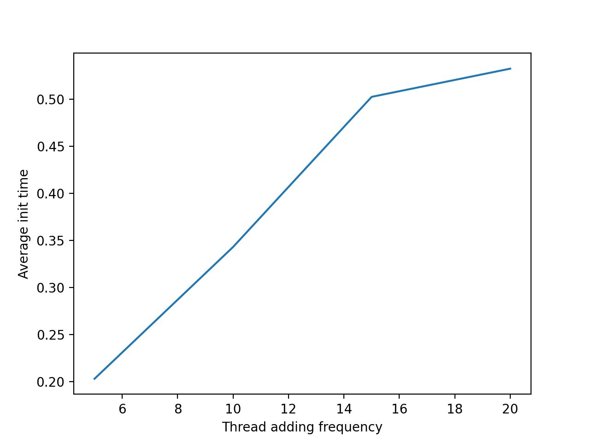
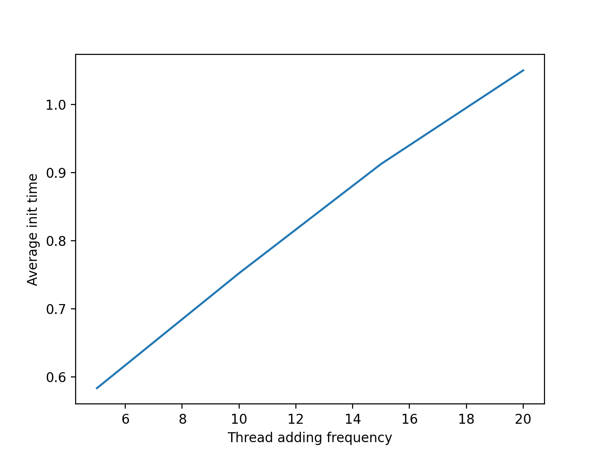
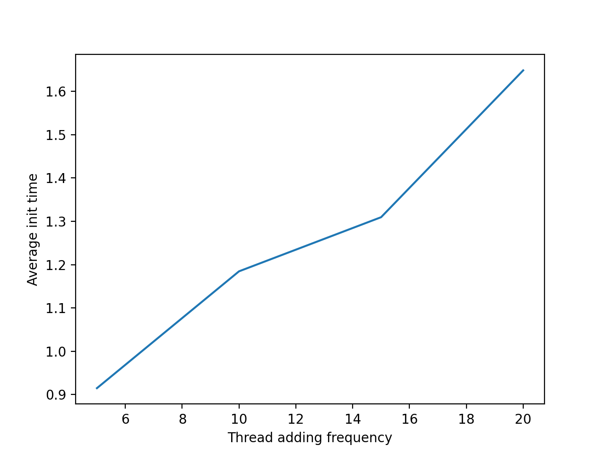
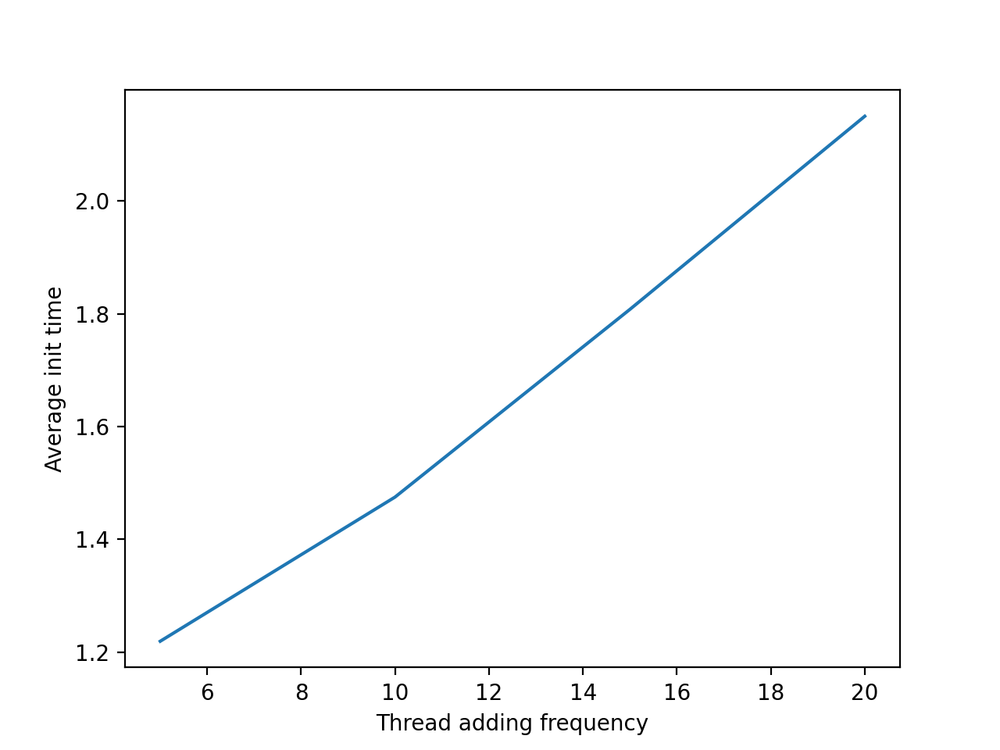

# ==Lab 3==

## Система обслуговування заявок при обмежених ресурсах
Implemented on `Python`.
Алгоритм PQ (Priority Queuing).

Ця стратегія передбачає, що кожному процесу надається  пріоритет, що визначає черговість надання йому CPU. Наприклад, стратегія FIFO передбачає, що всі процеси  мають однакові пріоритети, а стратегія SJF передбачає, що пріоритет є величина, обернена часу наступного обслуговування. 
Пріоритет — це ціле додатне  число, що знаходиться в деякому діапазоні, наприклад від  0 до 7, від  0 до 4095. Будемо вважати, що чим менше значення числа, тим вищий пріоритет процесу.

Щоб імплементувати такий алгоритм мені знадобився ще один потік, який буде добавляти нові потоки
кожних 5, 10, 20, 25 мс. Кожен тред виконується від 5 до 32 мс, тим самим імітуючи зайнятість потоку.
## Приклад виконання 
Конфіг: 
```
ADD_JOB_INTERVAL = 0.02
MAX_THREADS = 25
```
```
MANAGER         >> Queue size: 25
RUN     >> Thread-3     prepare to run. Total init time: 0.530250072479248
MANAGER         >> Queue size: 24
RUN     >> Thread-6     prepare to run. Total init time: 0.5002601146697998
MANAGER         >> Queue size: 23
RUN     >> Thread-26    prepare to run. Total init time: 0.06890988349914551
MANAGER         >> Queue size: 22
RUN     >> Thread-5     prepare to run. Total init time: 0.5607101917266846
MANAGER         >> Queue size: 21
RUN     >> Thread-17    prepare to run. Total init time: 0.31864094734191895
MANAGER         >> Queue size: 20
RUN     >> Thread-21    prepare to run. Total init time: 0.2627120018005371
MANAGER         >> Queue size: 19
RUN     >> Thread-23    prepare to run. Total init time: 0.22995305061340332
MANAGER         >> Queue size: 18
RUN     >> Thread-22    prepare to run. Total init time: 0.2795729637145996
MANAGER         >> Queue size: 17
RUN     >> Thread-20    prepare to run. Total init time: 0.33223700523376465
MANAGER         >> Queue size: 16
RUN     >> Thread-19    prepare to run. Total init time: 0.3645751476287842
MANAGER         >> Queue size: 15
RUN     >> Thread-24    prepare to run. Total init time: 0.28117990493774414
MANAGER         >> Queue size: 14
RUN     >> Thread-13    prepare to run. Total init time: 0.5301976203918457
MANAGER         >> Queue size: 13
RUN     >> Thread-16    prepare to run. Total init time: 0.47950100898742676
MANAGER         >> Queue size: 12
RUN     >> Thread-25    prepare to run. Total init time: 0.31351613998413086
MANAGER         >> Queue size: 11
RUN     >> Thread-11    prepare to run. Total init time: 0.6545720100402832
MANAGER         >> Queue size: 10
RUN     >> Thread-15    prepare to run. Total init time: 0.592785120010376
MANAGER         >> Queue size: 9
RUN     >> Thread-18    prepare to run. Total init time: 0.5475692749023438
MANAGER         >> Queue size: 8
RUN     >> Thread-14    prepare to run. Total init time: 0.6487491130828857
MANAGER         >> Queue size: 7
RUN     >> Thread-12    prepare to run. Total init time: 0.7010300159454346
MANAGER         >> Queue size: 6
RUN     >> Thread-7     prepare to run. Total init time: 0.8395650386810303
MANAGER         >> Queue size: 5
RUN     >> Thread-2     prepare to run. Total init time: 0.9716079235076904
MANAGER         >> Queue size: 4
RUN     >> Thread-8     prepare to run. Total init time: 0.8421738147735596
MANAGER         >> Queue size: 3
RUN     >> Thread-9     prepare to run. Total init time: 0.8418848514556885
MANAGER         >> Queue size: 2
RUN     >> Thread-4     prepare to run. Total init time: 0.970189094543457
MANAGER         >> Queue size: 1
RUN     >> Thread-10    prepare to run. Total init time: 0.8576970100402832

AVERAGE INIT: 0.5408015727996827

```
## Графіки
##### Конфіг 1:
```
ADD_JOB_INTERVAL = 0.02
MAX_THREADS = 25
```


##### Конфіг 2:
```
ADD_JOB_INTERVAL = 0.02
MAX_THREADS = 50
```


##### Конфіг 3:
```
ADD_JOB_INTERVAL = 0.02
MAX_THREADS = 75
```


##### Конфіг 4:
```
ADD_JOB_INTERVAL = 0.02
MAX_THREADS = 100
```

## Використання
python3 manage.py --lab 3

