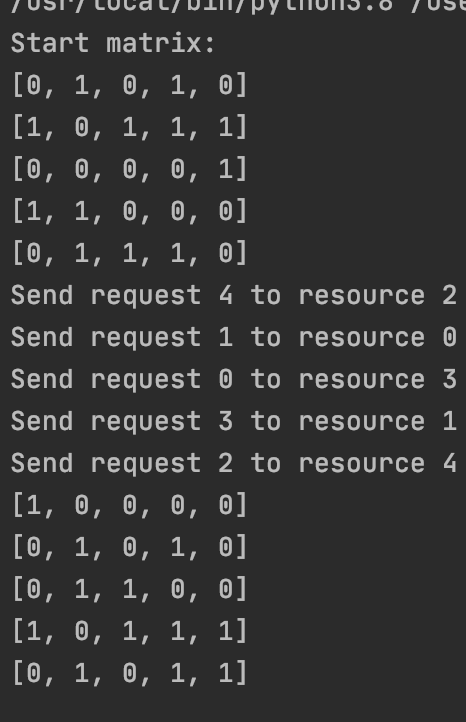

# ==Lab 4==

Implemented on `Python`.

### Скласти програму визначення (локалізації) зони пошуку розв’язку для графа з пересилками (число вершин не менше 30).
Нажаль мені не вдалося знайти визначення термінів "зони пошуку розв'язку для графа" та "граф з пересилками",
тому я зробив припущення що в завданні треба було знайти найкращі комбінації элементів графу.
Граф представлено за допомогою матриці, де стовпці це ресурси, а рядки це завдання. Тобто знайти оптимальну комбінацію ресурсів і завдань.
#### Алгоритм
1. Створюєм одновимірний масив resources та requests, довжина яких дорівнює кількості рядків початкової матриці.
2. Ітеруємся по матриці: а) Шукаєм мінімальний рядок в початковій матриці, починаючи із i-того рядка. б) Міняєм i-тий рядок із мінімальним в базовій матриці і в матриці resourse в) Виконуєм аналогічні операції для стовпців г) Комбінація resourсes[i], requests[i] буде оптимальною комбінацією.

